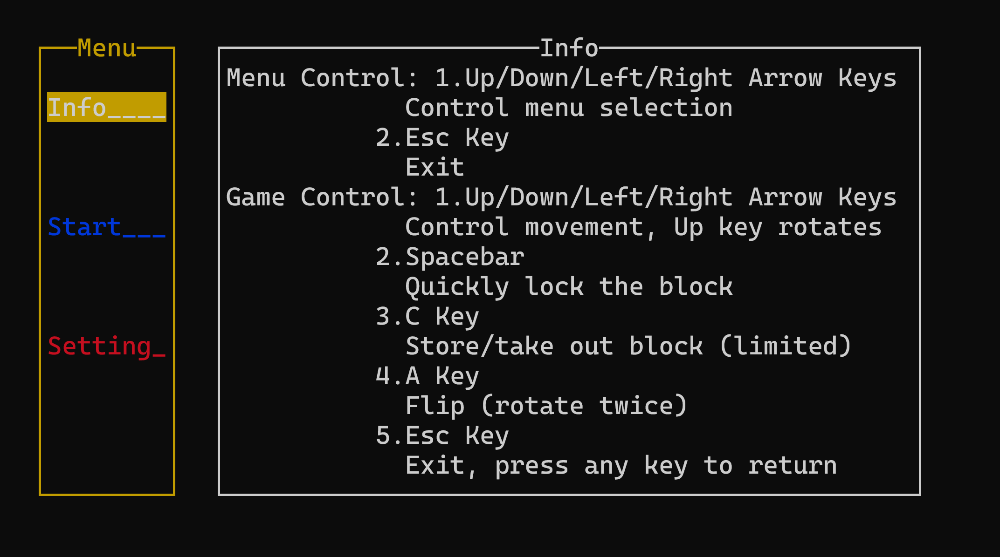
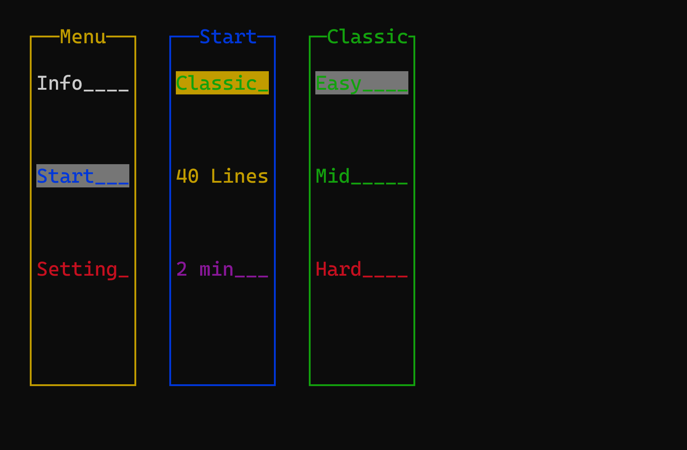
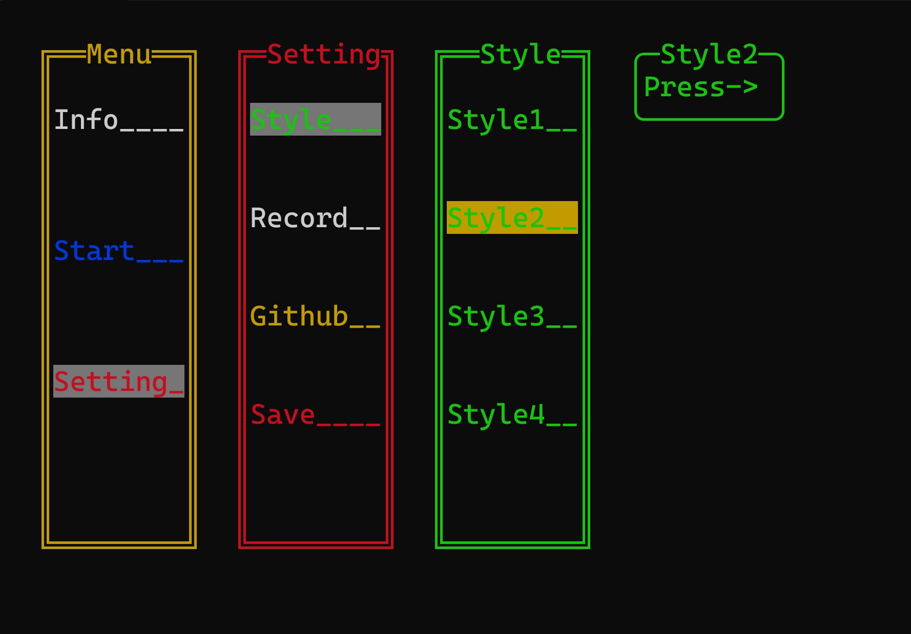
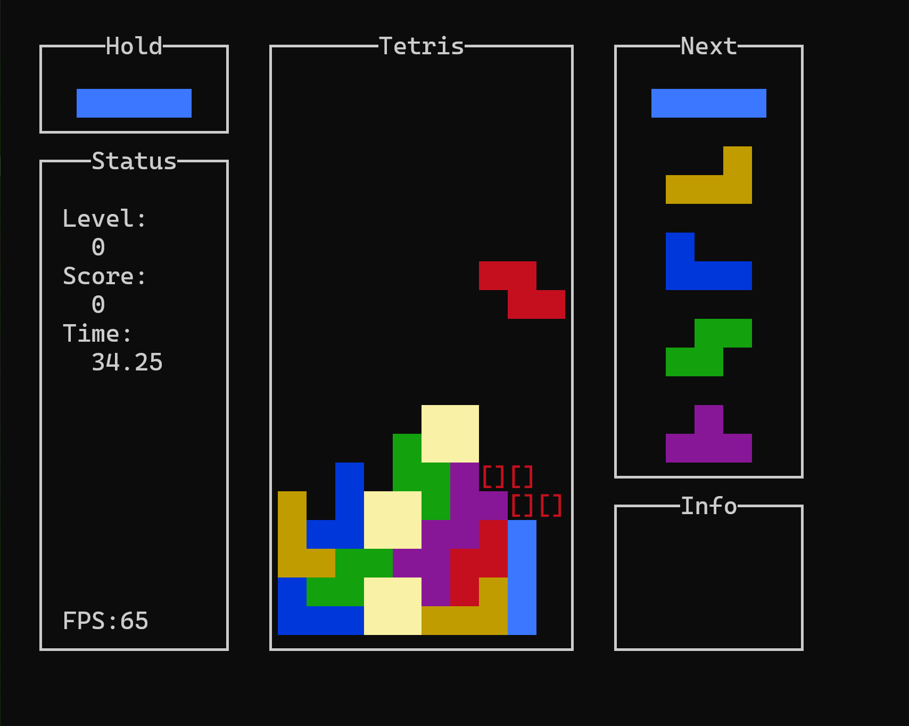

# Tetris-of-CMD
A highly polished command-line Tetris game

The development environment is  Visual studio C++

The source code is a complete mess. Well, I was a beginner when I wrote it and just used AI without proper architecture.

Fortunately, the final result turned out quite well.

# About this game:

I designed my own cmd menu framework to simply implement menus and events. I'll share the optimized code separately later.

It's recommended to download the release directly.

The rotation rules follow the Super Rotation System.

# Pictures

